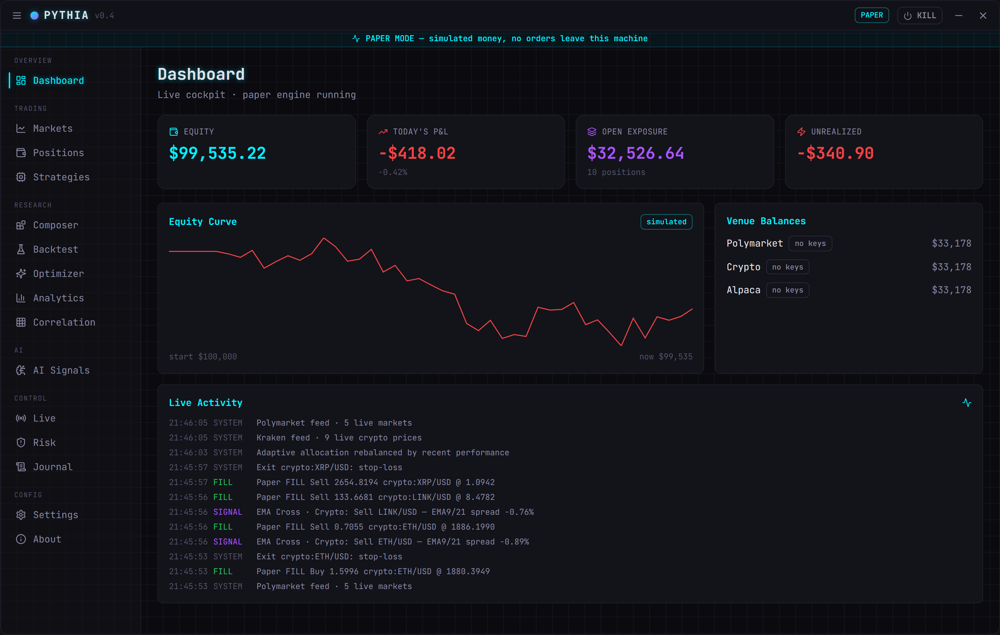
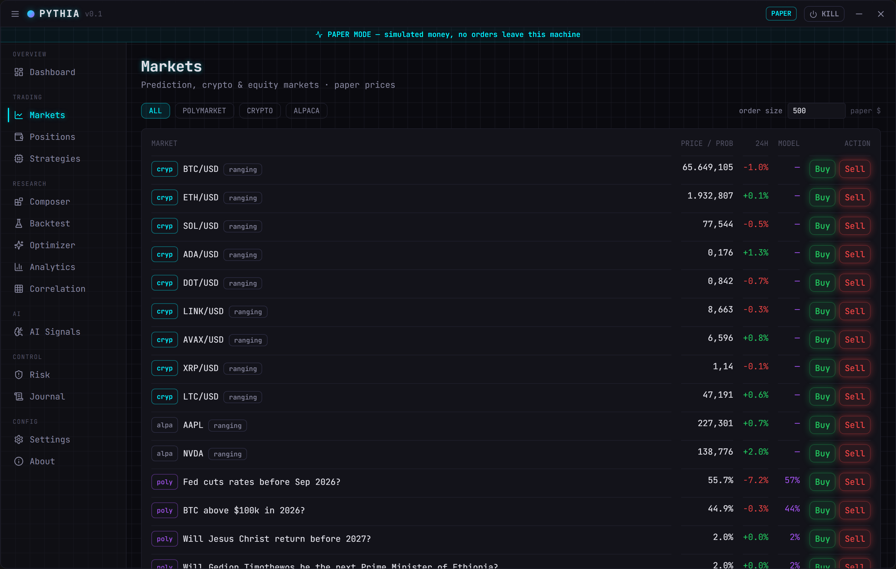
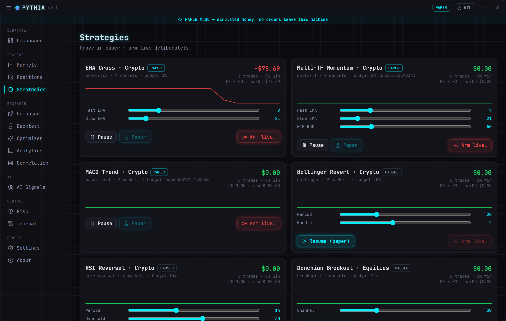
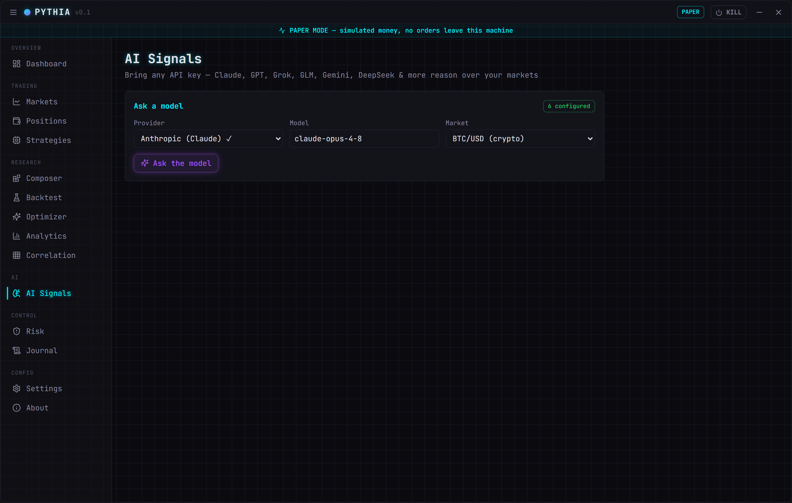
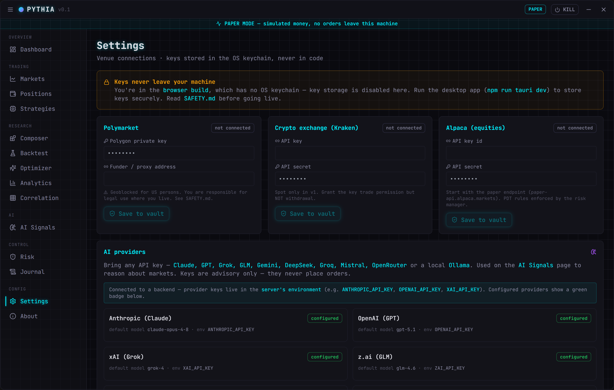
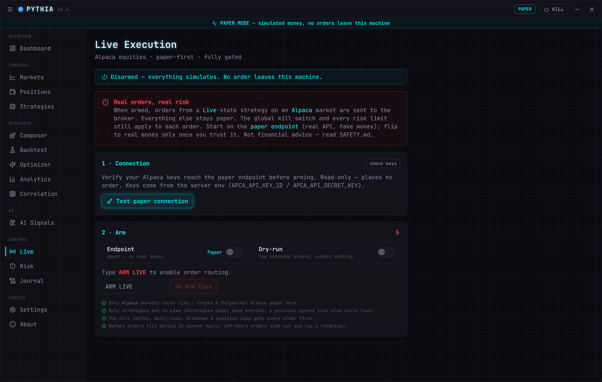
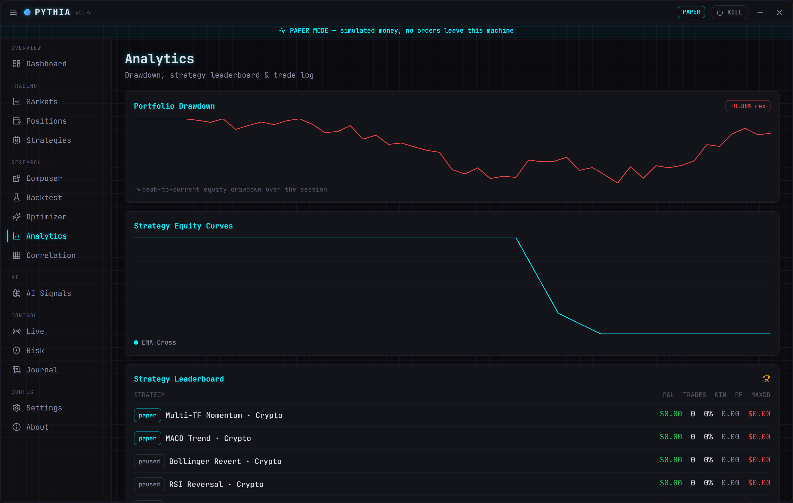
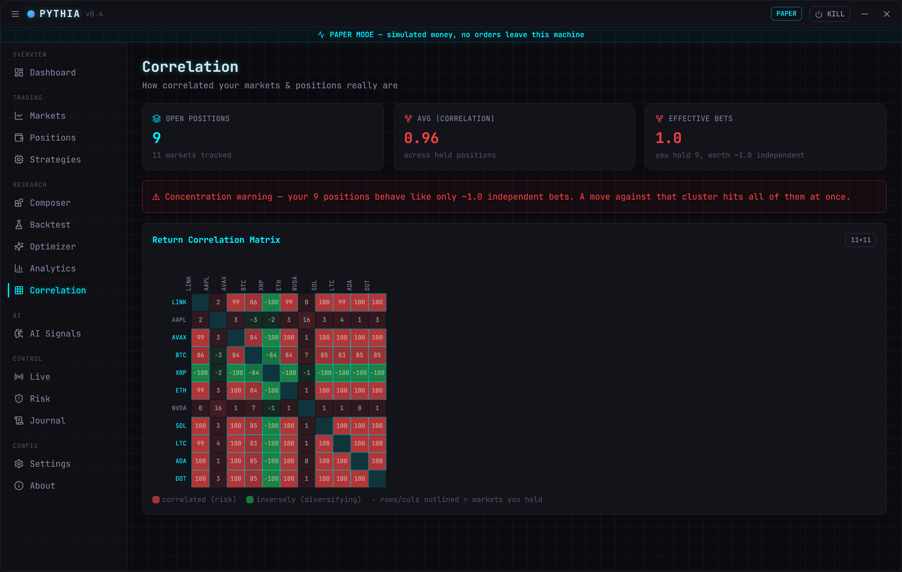
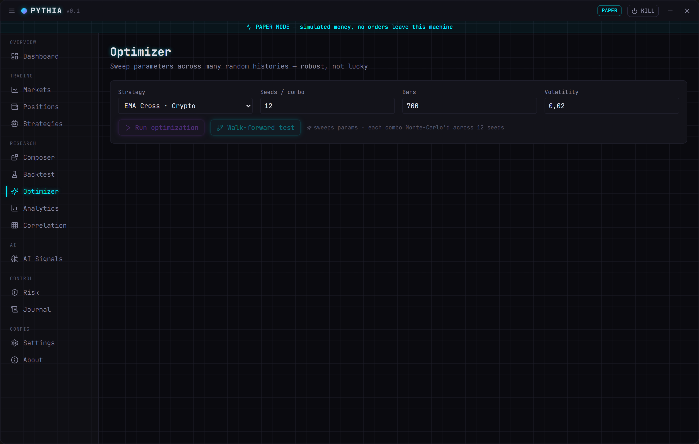

<div align="center">

# Pythia

### Autonomous multi-venue prediction &amp; trading cockpit — Polymarket · crypto · equities, one neon control panel

[](https://opensource.org/licenses/MIT)
[](https://v2.tauri.app)
[](https://react.dev)
[](https://www.typescriptlang.org)
[](https://www.rust-lang.org)
[](https://github.com/tokio-rs/axum)
[](https://tailwindcss.com)

<br>

[](#)
[](SAFETY.md)
[](#-ai-signals--bring-any-model)
[](https://github.com/SenseiIssei/Pythia)
[](https://github.com/SenseiIssei/Pythia)
[](https://github.com/SenseiIssei/Pythia/stargazers)

<br>

<a href="https://ko-fi.com/senseiissei">
  
</a>

<br><br>



</div>

---

Pythia forms an edge estimate for markets you choose, sizes a bet/trade with a disciplined risk
model, and — only when you explicitly arm a strategy — routes real orders. **It ships in paper
mode.** One engine core drives three runtimes (native desktop, web + backend server, browser paper),
and any large-language-model of your choice can weigh in on a market.

> ⚠️ **Before anything live, read [`SAFETY.md`](SAFETY.md) and the [`PLAN.md`](PLAN.md).** Automated
> trading and prediction-market betting can lose all your money. This is **not** financial advice.

---

## ✨ Highlights

- **One engine, three runtimes** — a shared Rust core (`crates/pythia-core`) runs as a native
  desktop daemon, behind a standalone HTTP/WebSocket **backend server**, or as a pure-TypeScript
  paper engine in the browser. All in lockstep, verified indicator-for-indicator.
- **10 strategies** — EMA cross, Bollinger revert, RSI reversal, MACD trend, Donchian breakout,
  multi-timeframe momentum, BTC/ETH pairs stat-arb, Prob-Edge (EWMA fair-value on live odds), plus a
  visual **Strategy Composer** that compiles rule sets into live strategies.
- **Sovereign risk manager** — global kill switch, max daily-loss &amp; drawdown breakers, per-strategy
  budgets, fractional-Kelly &amp; volatility-targeted sizing, regime filter, adaptive capital
  allocation, loss-streak cooldowns. Fails closed.
- **Research suite** — backtester, Monte-Carlo optimizer, walk-forward validation, analytics, and a
  return-correlation / concentration matrix.
- **🧠 AI Signals — bring any model** — Anthropic (Claude), OpenAI (GPT), xAI (Grok), z.ai (GLM),
  DeepSeek, Google (Gemini), Groq, Mistral, OpenRouter, or a local Ollama. Your key, your choice.
- **📡 Gated live execution (Alpaca)** — a real order path that ships **disarmed**. Arming needs a
  typed `ARM LIVE` confirmation; only Alpaca markets from a *Live* strategy route to the broker, and
  the kill switch + every risk limit gate each order. Start on the **paper endpoint** (real API, no
  real money), test the connection, then flip to real money once you trust it.
- **Real market data** — live Kraken crypto prices and Polymarket odds (no keys needed), plus real
  **Alpaca equity quotes** (AAPL, NVDA, MSFT, AMZN, TSLA) once your Alpaca keys are set, so live
  equities strategies trade on genuine prices rather than the simulator.
- **Secure by default** — API keys live in the OS keychain (desktop) or the server's environment,
  never in code, never logged, never returned to the UI. Discord/webhook alerts, persistent state,
  system tray, first-run legal gate.

---

## 📸 Screenshots

<table>
  <tr>
    <td width="50%"><br><sub><b>Markets</b> — live prices, odds &amp; regime badges</sub></td>
    <td width="50%"><br><sub><b>Strategies</b> — deploy, pause, tune, arm</sub></td>
  </tr>
  <tr>
    <td><br><sub><b>AI Signals</b> — any LLM reasons over a market</sub></td>
    <td><br><sub><b>Settings</b> — venue &amp; AI-provider keys (keychain)</sub></td>
  </tr>
  <tr>
    <td><br><sub><b>Live</b> — gated arm flow, paper-first</sub></td>
    <td><br><sub><b>Analytics</b> — drawdown, leaderboard, trade log</sub></td>
  </tr>
  <tr>
    <td><br><sub><b>Correlation</b> — return matrix &amp; concentration</sub></td>
    <td><br><sub><b>Optimizer</b> — Monte-Carlo robustness sweep</sub></td>
  </tr>
</table>

---

## 🧠 AI Signals — bring any model

Pythia's engine core speaks to **any** of these providers over your own API key. Anthropic uses the
Messages API; everything else speaks the OpenAI-compatible Chat Completions dialect, so one code path
covers the rest. Every model is overridable — type any model id you like.

| Provider | id | Env var | Default model | Notes |
|---|---|---|---|---|
| Anthropic (Claude) | `anthropic` | `ANTHROPIC_API_KEY` | `claude-opus-4-8` | Messages API + adaptive thinking |
| OpenAI (GPT) | `openai` | `OPENAI_API_KEY` | `gpt-5.6` | Sol; `-terra` / `-luna` tiers |
| xAI (Grok) | `xai` | `XAI_API_KEY` | `grok-4.5` | |
| z.ai (GLM) | `zai` | `ZAI_API_KEY` | `glm-5.2` | |
| DeepSeek | `deepseek` | `DEEPSEEK_API_KEY` | `deepseek-v4-pro` | also `-flash` |
| Google (Gemini) | `google` | `GEMINI_API_KEY` | `gemini-3-pro` | OpenAI-compat endpoint |
| Groq | `groq` | `GROQ_API_KEY` | `llama-3.3-70b-versatile` | Kimi K2, DeepSeek-R1 too |
| OpenRouter | `openrouter` | `OPENROUTER_API_KEY` | `openai/gpt-5.6` | any model on OpenRouter |
| Mistral | `mistral` | `MISTRAL_API_KEY` | `mistral-large-latest` | Mistral Large 3 |
| Ollama (local) | `ollama` | — | `llama3.3` | no key; runs on your box |

<sub>Defaults track the current flagships (July 2026); every model is overridable — type any model id in the picker.</sub>

Each request returns a structured signal — `{ probability, direction, confidence, rationale }` —
clamped and stamped with the provider/model that answered.

> 🔒 **AI signals are advisory only.** No model reliably predicts prices, and **none of them place
> orders.** Treat a signal as one input among many.

**Where keys live:** the **desktop app** stores provider keys in the OS keychain (manage them in
*Settings → AI providers*). The **backend server** reads keys from its own environment. The browser
paper build can't reach model APIs and shows the feature as unavailable.

---

## 🚀 Run it

**One UI, three runtimes.** The cockpit auto-detects where it's running and wires itself up.

### Native desktop app (recommended — real read-only market data)

```bash
npm install
npm run tauri dev     # dev window with hot-reload (needs the Rust toolchain)
npm run tauri build   # Windows installer + Pythia.exe → src-tauri/target/release/bundle/nsis/
```

Runs a persistent Rust engine that fetches **live Kraken crypto prices** and **Polymarket odds**
(read-only, no keys) and paper-trades against them.

### Standalone backend server (for a web dashboard or phone app)

```bash
cargo run -p pythia-server        # listens on http://0.0.0.0:8787
```

| Route | Purpose |
|---|---|
| `GET /api/state` | current engine state (JSON) |
| `GET /api/stream` | WebSocket — full state pushed every tick |
| `POST /api/command` | mutate the engine (kill switch, limits, strategies, orders) |
| `GET /api/llm/providers` | which providers have a key in the server env |
| `POST /api/llm/signal` | ask a provider for a signal (`{provider, model, context}`) |
| `POST /api/live/config` | arm/disarm live execution (`{armed, paper, dryRun}`) |
| `GET /api/live/account` | Alpaca account check (buying power/status) |

Env: `PYTHIA_BIND` (default `0.0.0.0:8787`), `PYTHIA_WEBHOOK_URL`, any provider key
(`ANTHROPIC_API_KEY`, `OPENAI_API_KEY`, `XAI_API_KEY`, …), and Alpaca for real equity quotes +
live execution: `APCA_API_KEY_ID`, `APCA_API_SECRET_KEY`, `APCA_FEED` (default `iex`, the free tier;
paid plans can use `sip`).

### Browser / web app (no Rust, no keys — explore the UI)

```bash
npm run dev           # http://localhost:5174 — paper mode
```

To make the browser build a thin client of the backend server, set
`VITE_PYTHIA_SERVER=http://localhost:8787` (e.g. in `.env.local`) before `npm run dev`.

> **Windows Rust build note:** if `cargo` fails with `failed to find tool "C:\Program"`, unset the
> machine `CC`/`CXX` env vars first: `unset CC CXX CFLAGS CXXFLAGS` (they contain spaces that break
> `cc-rs`).

---

## 🗂 Layout

```
Pythia/                     # Cargo workspace
├─ PLAN.md · SAFETY.md      # the master plan · read before going live
├─ crates/pythia-core/      # the shared engine brain (no UI): strategies, indicators,
│  └─ src/                  #   risk, connectors, market data, vault, alerts, llm (AI signals)
├─ server/                  # standalone backend — axum HTTP + WebSocket over pythia-core
├─ src-tauri/               # native desktop shell (Tauri v2) — thin layer over pythia-core
└─ src/                     # React cockpit (also runs standalone via the TS paper engine)
   ├─ engine/               #   TS mirror of the core + Tauri/Server/Paper clients
   ├─ pages/                #   Dashboard, Markets, Positions, Strategies, Composer, Backtest,
   │                        #   Optimizer, Analytics, Correlation, AI Signals, Risk, Journal, …
   └─ components/           #   neon UI kit
```

---

## 🛡 Modes &amp; safety

- **Paper (default):** a simulated matching engine fills orders against live/replayed prices with a
  fake balance. Prove strategies here first.
- **Live (gated):** requires your own API keys (OS keychain) and a per-strategy, typed confirmation
  to arm. The global kill switch and risk limits always apply. Polymarket is geoblocked for US
  persons — confirm legality where you live.

Read [`SAFETY.md`](SAFETY.md) in full before enabling anything live.

### Going live (Alpaca, paper-first)

📖 **Full step-by-step runbook: [`docs/LIVE-RUN.md`](docs/LIVE-RUN.md)** — keys, verification,
arming, what the journal looks like, market hours, and how to stop.

Live execution is wired for **Alpaca equities** and ships **disarmed**. The short version:

1. Add your Alpaca keys — desktop: *Settings → Alpaca* (OS keychain); server: `APCA_API_KEY_ID` /
   `APCA_API_SECRET_KEY` env vars. The equity markets immediately switch from the simulator to
   **real Alpaca quotes**, so signals are computed on genuine prices.
2. Open **Live** → *Test paper connection* (read-only; shows account status + buying power).
3. Keep the endpoint on **Paper**, type `ARM LIVE`, and arm. Set a strategy to **Live** on the
   Strategies page — its Alpaca orders now hit `paper-api.alpaca.markets` (real order lifecycle, no
   real money). Use **Dry-run** to log intended orders without sending them anywhere.
4. Only once you trust it, flip the endpoint to **Live** and re-arm for real money.

Only Alpaca markets from a Live strategy ever route to the broker; crypto and Polymarket stay paper.
The kill switch and every risk limit gate each order first.

---

<div align="center">

Built by **SenseiIssei**. If Pythia is useful to you:

<a href="https://ko-fi.com/senseiissei">
  
</a>

</div>
